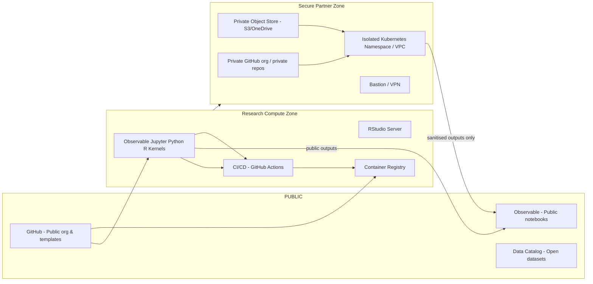
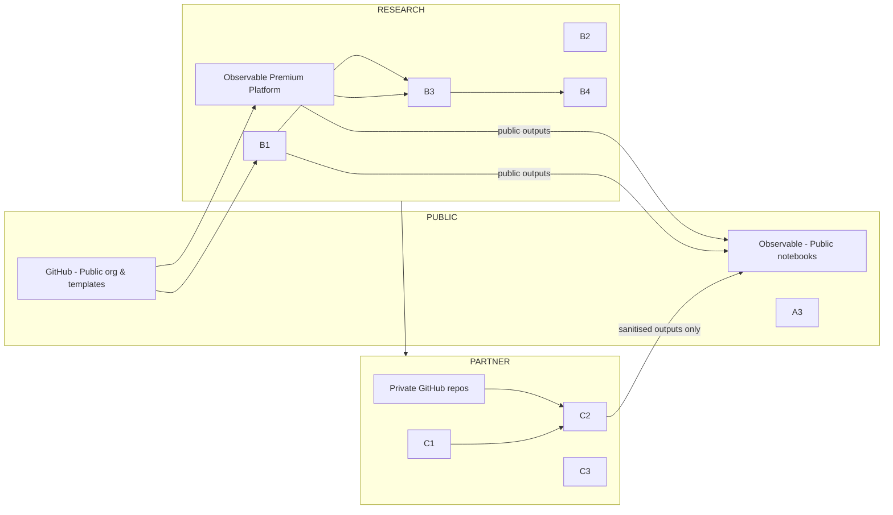
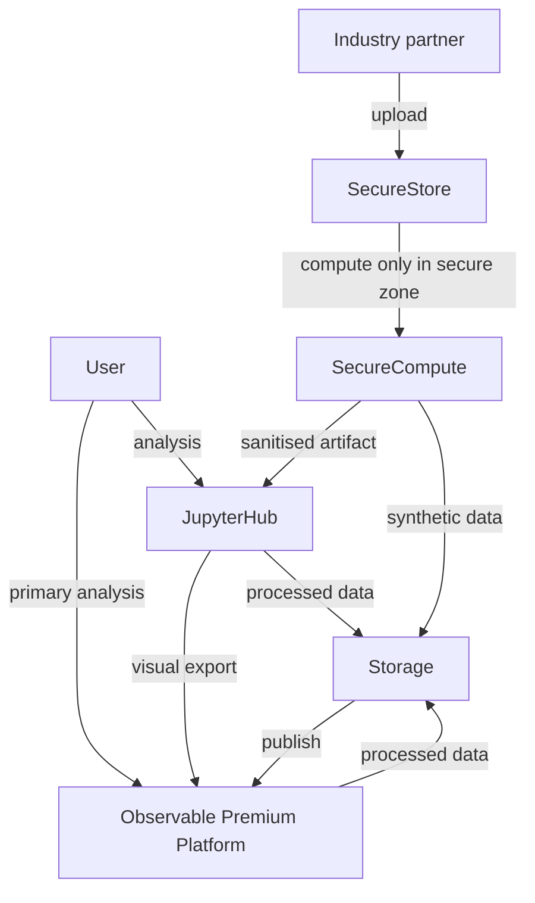

# EPSRC Diverse CDT — Infrastructure Design

> **Purpose:** A complete design and communication bundle that enables PhD students to perform data-visualisation research using Observable, d3, R, Python and Jupyter notebooks while also supporting secure, NDA-protected collaborations with industry partners.

---

## overview (what you will find in this document)

1.  System Design - full technical & governance proposal
2.  Visual Architecture Diagrams — Mermaid diagrams (system + data flow)
3.  Prototype / proof-of-concept checklist & minimal configuration
4.  Governance & data classification template (for industry data)
5.  Implementation roadmap, milestones, acceptance criteria

---

# 1. System Design (Detailed)

## 1.1 Executive summary

A secure, hybrid research platform for the Diverse CDT that:

a. encourages open knowledge sharing among PhD students (Observable notebooks , public repos, tutorial hubs)

b. supports reproducible analysis (Jupyter, RStudio, conda/renv environments)

c. provides segregated secure environments for industry collaborators to work on proprietary data (secure on-prem servers , private containers, VPN or dedicated tenant).

The proposal balances openness and confidentiality through data classification, access controls, and modular infrastructure components.

### Goals

- Fast onboarding for new students
- Reproducible computational environments (Python/R/Jupyter/Observable interoperability)
- Clear separation of open vs confidential data
- Easy sharing of techniques and non-sensitive artifacts
- Ability to run compute on cloud or locally depending on nature of data.
- Long-term maintainability by the RSE

### Non-goals

- Replace university-wide identity or central storage (will integrate with existing SSO and storage where possible)
- Perform heavy enterprise IT tasks beyond the RSE remit (e.g., full-time SOC)

## 1.2 Stakeholders & user roles

- **PhD students (primary users)** — create notebooks, visualisations, publish public demos
- **Supervisors** — review student work, provide academic access
- **Industry partners** — supply confidential datasets under NDAs, require isolated compute/storage
- **RSE / Admins** — maintain the platform, manage onboarding and incident response
- **University IT / Security** — ensure compliance with GDPR, university policies

## 1.3 Requirements

### Stakeholder Requirements Matrix:

| Stakeholder Group | Core Objective                                                                            | Key Challenges                                                                                   | Required Platform Features                                                                                                                                                         | Technical Implications                                                                                                                       |
| ----------------- | ----------------------------------------------------------------------------------------- | ------------------------------------------------------------------------------------------------ | ---------------------------------------------------------------------------------------------------------------------------------------------------------------------------------- | -------------------------------------------------------------------------------------------------------------------------------------------- |
| PhD Student       | Conduct original research, develop skills, and build a professional portfolio.            | Isolation, time pressure, tool complexity, unclear career path.                                  | Unified notebook environment (Observable, Jupyter, R); integrated version control; peer collaboration tools; public/private portfolio management; accessible documentation.        | Premium Observable platform, containerized environments, Git integration, centralized knowledge base, role-based access control (RBAC).      |
| Faculty & Admin   | Ensure academic quality, monitor student progress, manage program operations efficiently. | Information silos; administrative overhead; managing industry partnerships.                      | Centralized student dashboard; progress tracking; in-context feedback tools; GitHub Classroom; knowledge management system (KMS).                                                  | Unified web portal with API integrations; Git-based review workflows; KMS (e.g., GitHub Wiki), SSO authentication.                           |
| Industry Partner  | Access talent and research to solve business problems; protect proprietary data and IP.   | Data security risks; lengthy legal negotiations; unclear project oversight; differing timelines. | Trusted Research Environment (TRE); synthetic data and schema generation; standardized legal agreement templates; secure project management space; controlled collaborator access. | Isolated on-prem/cloud environment (VPC); data ingress/egress "airlock"; containerization; robust logging/auditing; dedicated secure portal. |

### Functional

- **Observable-first Environment:** Premium Observable platform as the default, partner-supported environment for visualization and collaborative analysis.
- **Secondary Compute:** JupyterHub multi-user environment supporting Python and R kernels for tasks not suited to Observable.
- **Git-based Collaboration:** GitHub organization with templates for reproducible projects and GitHub Classroom for coursework.
- **/environment management:** conda + pip + renv for R.
- **Notebook to static export pipeline:** Observable Framework, `nbconvert`, or Quarto for publishing.
- **Data Access & Generation:** Secure data enclaves, plus mechanisms for schema generation and synthetic data generation.
- **Access Control:** Fine-grained access control and audit logging for industry datasets.

### Non-functional

- Security: encryption at rest and in transit; MFA for partner accounts.
- Scalability: support \~60 active students, burst compute via cloud/HPC.
- Usability: one-click environment replication, templates, onboarding docs.
- Maintainability: containerised services, IaC (Terraform/Ansible) and CI for infra.

## 1.4 High-level architecture

- **Public/Shared zone** — for open datasets, Observable public notebooks, public GitHub org.
- **Research compute zone** — **Observable Premium Platform** (primary), supplemented by JupyterHub and RStudio-Server for specialized compute, authenticated by university SSO.
- **Secure partner zone** — Phased approach starting with **on-premise secure servers** and/or secure Observable workspaces. Evolves to an isolated cloud tenant or VPC with separate object storage, strict Firewall rules, VPN/bastion access, and per-project access control.
- **CI / Automation** — GitHub Actions for environment builds and reproducible workflows.
- **Data catalog & metadata** — lightweight catalog (e.g., DataHub, CKAN instance or markdown-based registry) tagging data as `open`, `restricted`, `confidential`.

## 1.5 Technical stack (recommended)

- **Compute & orchestration:** Kubernetes (EKS/GKE/AKS) or university HPC; use Helm for JupyterHub (Zero to JupyterHub) or JupyterHub + KubeSpawner.
- **Notebooks & IDEs:**
  - **Primary:** **Observable Premium Platform**. This is the default, partner-supported environment for all students. It is browser-based, requires zero setup, and excels at real-time collaboration and interactive visualization.
  - **Secondary:** **JupyterHub** (Python/R kernels) and **RStudio Server** for workloads not suited to Observable (e.g., heavy ML, legacy R scripts).
- **Source control:** **GitHub organization** for the CDT. This is recommended over self-hosting to reduce RSE overhead. It provides:
  - **GitHub Classroom** for streamlined faculty management of coursework.
  - Mature tooling, a large community, and strong integration with third-party services.
  - Excellent integration with Observable for notebook backups and local framework development.
- **Authentication:**
  - Invited Github accounts
  - University SSO (SAML/OAuth) + invited partner accounts;
  - enforce 2FA/MFA.
- **Storage:** University-backed object store (S3-compatible) with bucket policies; separate buckets/tenants for partner data.
- **Secrets & keys:** HashiCorp Vault or cloud-native KMS for secret management.
- **Container registry:** Private registry (Harbor, ECR, GCR) for reproducible images.
- **Environment reproducibility:** `conda` + `environment.yml`, `renv.lock` for R; Quarto for notebooks to HTML/website.
- **Observability & logging:** Prometheus + Grafana for metrics; ELK or Loki for logs.
- **Infrastructure as Code:** Terraform + Helm + GitOps (ArgoCD) for desired-state infra.

## 1.6 Data governance & security model

A robust governance framework is essential to manage the movement of data between the architectural zones. This framework is built on a formal Data Classification Policy and a secure "airlock" protocol for all sensitive data movement.

### Data Flow and Governance

- **Authentication and Authorization:**

  - For on-prem systems, a unified identity management solution, federated with the university's central SSO service, will assign roles (e.g., 'Student', 'Faculty', 'Industry-Mentor-ProjectX'). These roles enforce Role-Based Access Control (RBAC) across all components.

  - For online systems like GitHub and observable current group invites will be maintained.

- **Data Ingress/Egress Protocols for TRE:** The boundary of the Secure Partner Zone (TRE) is the most critical control point. All data movement is managed by a formal "airlock" protocol.
  - **Ingress:** Data from an industry partner is first uploaded to a secure, isolated staging area. Here, it undergoes automated checks (e.g., malware scanning) before being formally ingested into the project's dedicated storage within the TRE. This process is fully logged.
  - **Egress:** No data can leave the TRE without undergoing a formal review process that embodies the "Safe Outputs" principle. A researcher must submit an egress request (e.g., for a chart, an aggregated table, or a trained synthetic data model). This request is placed in a secure review queue for manual approval from multiple stakeholders (e.g., PI, Data Security Officer, Industry Partner). This human-in-the-loop process is the ultimate safeguard against accidental data leakage.

### Data Classification and Handling Policy

A formal policy is the central artifact that determines the required security controls and legal agreements for any given project.

| Level  | Classification        | Tag | Description & Examples                                                                               | Permitted Storage Location                                              | Required Access Controls                                                                                  | Required Legal Agreement                                                  | Egress Protocol                                          |
| :----- | :-------------------- | :-- | :--------------------------------------------------------------------------------------------------- | :---------------------------------------------------------------------- | :-------------------------------------------------------------------------------------------------------- | :------------------------------------------------------------------------ | :------------------------------------------------------- |
| **L1** | **Public**            | O   | Open-source code, published papers, anonymized public datasets.                                      | Public GitHub repository, program website.                              | Public access.                                                                                            | None (or standard open-source license).                                   | N/A                                                      |
| **L2** | **Internal**          | I   | Course materials, draft manuscripts, non-sensitive research data for internal collaboration.         | Program's private GitHub organization.                                  | University SSO authentication required. Access controlled at the group/project level.                     | None (covered by university policies).                                    | Self-service.                                            |
| **L3** | **Confidential**      | C   | Anonymized or de-identified data from a partner, proprietary but non-sensitive business information. | Program's private GitHub organization (in a restricted-access project). | Multi-factor authentication (MFA) recommended. Strict, named-user access lists.                           | Data Transfer and Use Agreement (DTUA) or Non-Disclosure Agreement (NDA). | Self-service, but logged.                                |
| **L4** | **Highly Restricted** | R   | Personally Identifiable Information (PII), raw proprietary data, commercially sensitive IP.          | Trusted Research Environment (TRE) only.                                | MFA mandatory. Access via secure gateway (VPN/Bastion). No internet access from VRE. All activity logged. | Sponsored Research Agreement (SRA) with specific data security clauses.   | Formal, multi-stage "Airlock" approval process required. |

## 1.7 Research Environment & Integration patterns

This architecture uses an "Observable-first" strategy, providing students with a best-in-class tool for the CDT's core mission (visualization) while offering a robust, containerized fallback for all other computational tasks, all version-controlled in GitHub.

- **Observable (Primary Platform):** As the program's official partner, the **premium Observable platform** is the default, fully supported environment.

  - **Mode 1: Premium Cloud Platform:** Used for zero-setup, browser-based analysis, real-time "multiplayer" collaboration, and easy sharing of private notebooks within the CDT and with partners.
  - **Mode 2: Observable Framework (Local):** For more complex, software-defined projects, students will use the **Observable Framework**. This allows them to build data apps as local Markdown, JS, and data files, which are naturally version-controlled in their GitHub repository.
  - **Git Integration:** Work on the cloud platform can be automatically backed up to GitHub repositories using webhooks and GitHub Actions.

- **Jupyter & R (Secondary Compute):** For tasks outside Observable's scope (e.g., training large ML models, using legacy R libraries), the CDT will provide a secondary compute environment orchestrated by **JupyterHub**.

  - **Orchestration:** JupyterHub will launch isolated, single-user **containerized** environments, allowing a student to choose a "JupyterLab" or "RStudio Server" profile.
  - **Git Integration:** The JupyterLab environment will be pre-configured with the `jupyterlab-git` extension for a graphical Git interface. We will also enforce notebook-friendly diffing and merging using tools like `nbdime` and pre-commit hooks to clear output cells, ensuring repositories remain clean.
  - **Interoperability:**
    - The `observable-jupyter` library can be used to embed Observable cells directly into Jupyter notebooks for mixed workflows.
    - The `rpy2` library will be included to provide a seamless bridge between R and Python in the same analysis.

- **d3:** Delivered as JS modules within Observable and as static outputs (via `IPython.display.HTML`) or saved files from Jupyter/R.

- **Data flow (Core Principle):** Data is **always isolated from the notebook**. Notebooks are the presentation/analysis layer. Data is stored in Git (for L1-L3 data) or the secure object store (for L4 data) and loaded at runtime.

## 1.8 Knowledge Management

To combat information silos ("knowledge in people's heads") and avoid the overhead of a separate platform (like Confluence or SharePoint ), the central Knowledge Management System (KMS) will be built directly into the **GitHub Organization**.

- **Co-location:** All technical documentation, "how-to" guides, tutorials, and software guides will live "where the technical work happens." This lowers the barrier to both finding and contributing to documentation.
- **GitHub Wikis:** Each major project (or a central CDT-wide repository) can use its Wiki for simple, collaborative, Markdown-based documentation.
- **Dedicated Repositories:** Formal documents (e.g., "Student Handbook," "Industry Onboarding Guide") will be managed in dedicated Git repositories. This treats program documentation like code: it is version-controlled, can be updated via pull requests (allowing for review of policy changes), and has a full change history.
- **No Additional Cost:** This functionality is included with the GitHub organization, requiring no new software, servers, or user accounts.

## 1.9 Secure Research Environment for Industry Collaboration

The Secure Partner Zone, or Trusted Research Environment (TRE), is the most critical component for industry engagement. It is the technical implementation of the program's commitment to data security and will be guided by the **Five Safes Framework** (Safe People, Safe Projects, Safe Settings, Safe Data, Safe Outputs).

### Phased Implementation

- **Phase 1: On-Premise SDE & Partner Cloud:** For initial projects, the TRE will leverage existing, controllable resources.

  - **University On-Premise Servers:** Utilize secure, firewalled on-premise servers managed by university IT. These will be configured as a "Secure Data Enclave" (SDE) with an isolated network, controlled access via secure gateway (e.g., remote desktop), and full auditing.
  - **Observable Premium Instance:** For projects where data can be securely _queried_ without being _moved_, the premium Observable instance can be used. It provides enterprise-grade access controls, and notebooks can be kept private to the project team.

- **Phase 2: Cloud-Native TRE (Future Enhancement):** As the program scales, a full-scale cloud-native TRE will be built (e.g., on AWS or Azure). This provides superior scalability and advanced security services, following reference architectures like SATRE.

### Data Access Solutions for Sensitive Data

When partners cannot share raw (L4) data, the TRE will facilitate two crucial alternative workflows:

1.  **Schema Generation:** For projects where the _structure_ of the data is sufficient, a formal process will be used:

    - The partner provides a detailed description of the data's properties, characteristics, and constraints.
    - The RSE and student use this to create a formal, shareable **data schema** (e.g., using JSON Schema, XML Schema, or other database schema tools).
    - This schema is version-controlled in GitHub and used to build analysis pipelines that can be run on the real data within the partner's environment later.

2.  **Synthetic Data Generation:** To create a high-fidelity, statistically similar but anonymous dataset, a secure workflow will be used:

    - **Step 1 (Ingress):** The partner's L4 confidential dataset is securely transferred _into_ the TRE.
    - **Step 2 (Training):** Inside the TRE (on the on-prem server), the researcher uses an approved Python library (e.g., **Synthetic Data Vault (SDV)**, **YData-Synthetic**, or GAN-based models like **CTGAN**) to train a generative model. This model learns the statistical patterns of the real data.
    - **Step 3 (Generation):** The _model_ is used to generate a new, synthetic dataset. Differential privacy techniques can be applied during this step to provide mathematical privacy guarantees.
    - **Step 4 (Egress):** The _synthetic_ dataset (now classified as L2 or L3) and a quality report (e.g., from SDMetrics) undergo the formal "Airlock" egress review to validate its utility and privacy. Once approved, this privacy-safe dataset can be moved to the main GitHub organization for wider student use.

### Containerization for Security and Reproducibility

Containerization via **Docker** is a fundamental building block for both the secondary compute environment (JupyterHub) and the TRE. It ensures security and reproducibility.

- **Security:** Containers provide process and filesystem isolation. All user code will run inside minimal, unprivileged containers (not as `root`).
- **Reproducibility:** A `Dockerfile` explicitly defines the entire software environment, guaranteeing that an analysis can be re-run and produce the same results.
- **Best Practices:** The system will use a **private container registry** to store only vetted, security-scanned images. Minimal base images (e.g., Alpine) will be used to reduce the attack surface.

## 1.10 Operational model

- **Dedicated Personnel:** The **Research Software Engineer (RSE)** is responsible for maintaining the infrastructure, managing the TRE (including the data airlock), providing expert support to students and faculty, and developing training.
- **Onboarding:** student runbook + one-day workshop; partner onboarding checklist and security review.
- **Support:** RSE provides Tier 1 support; university IT handles SSO & hardware-level incidents.
- **Backups & DR:** periodic snapshotting of object storage and critical services; test restore annually.
- **Cost model:** mixture of university allocation + partner contributions for secure compute/storage.

## 1.11 Training & documentation

- **Templates:** GitHub repo templates for new projects (incorporating `environment.yml`, `renv.lock`, and data separation).
- **Tutorials:** Housed in the GitHub Wiki. Will cover:
  - Observable (Online Platform vs. Local Framework).
  - GitHub-Observable integration.
  - Jupyter-Git workflow (`jupyterlab-git`, `nbdime`).
  - Working in the Secure Partner Zone.
- **Regular runbook:** standard operating procedures for handling partner data breaches, escalation path.

## 1.12 Implementation roadmap & milestones

- **Phase 1 (Months 1-6): Foundational Infrastructure and Core Collaboration**

  - **Objective:** Establish the basic collaboration and communication backbone.
  - **Key Actions:**
    1.  Establish a **GitHub Organization** for the CDT, configure security policies (e.g., mandatory MFA), and set up **GitHub Classroom** for the first cohort's coursework.
    2.  Develop and launch the initial version of the **Program Hub** portal (e.g., using a platform like Pathify or ReadyEducation , or a custom build) with SSO, basic dashboards, and announcements.
    3.  Establish **GitHub Wikis** and a dedicated 'CDT-Handbook' repository as the central **Knowledge Repository**.
  - **Acceptance Criteria:** All students/faculty can log in. Faculty can create and distribute assignments via GitHub Classroom. A student can create, share, and collaborate on an Observable notebook.

- **Phase 2 (Months 7-12): Integrated Research and Development Environments**

  - **Objective:** Provide flexible, supplementary compute tools and establish Git-based best practices.
  - **Key Actions:**
    1.  Deploy the _secondary_ **JupyterHub** platform on a container orchestration service for specialized Python/R workloads.
    2.  Develop and test container images for JupyterLab (with Git extension ) and RStudio Server.
    3.  Establish and document the GitHub-Observable integration workflows (e.g., automated backups ).
    4.  Deliver hands-on workshops on the integrated workflow (Observable-first, Jupyter-secondary, Git-everywhere).
  - **Acceptance Criteria:** A student can launch a JupyterLab environment, clone a GitHub repo, perform analysis, and push changes. The Observable-to-GitHub backup workflow is functional.

- **Phase 3 (Months 13-18): The Trusted Research Environment and Industry Onboarding**

  - **Objective:** Build and accredit the high-security environment to enable collaborations.
  - **Key Actions:**
    1.  Deploy the **Phase 1 Secure Environment** using **on-premise university servers**.
    2.  Work with university legal to finalize the suite of **Data Sharing Agreement templates** (NDA, DTUA, SRA).
    3.  Develop and pilot the **synthetic data generation** and **schema generation** workflows with a test dataset.
    4.  Undergo a formal security audit of the Phase 1 TRE.
    5.  Pilot the full process with the first industry partner.
  - **Acceptance Criteria:** A formal data sharing agreement is signed. L4 data is securely ingested into the on-prem TRE. A student can access the TRE via secure remote desktop, perform analysis, and successfully export a sanitized result via the "airlock" approval workflow.

## 1.13 Risks & mitigations

- **Risk:** Data exfiltration from student notebooks.

  **Mitigation:** Network egress controls and formal "airlock" review in secure zone , user training, code review for exports.

- **Risk:** High operational overhead.

  **Mitigation:** Automate with IaC, use managed cloud services (GitHub SaaS, Observable SaaS) where possible to reduce RSE burden.

- **Risk:** Synthetic data is not high-fidelity or leaks private information.

  **Mitigation:** Use established validation libraries (e.g., SDMetrics) to compare statistical distributions before egress. Apply differential privacy techniques during generation. Mandate that only the _synthetic_ data, not the _model_, can be egressed.

- **Risk:** Tooling complexity overwhelms students.

  **Mitigation:** Adopt an "Observable-first" default. Provide clear documentation via the GitHub Wiki and hands-on workshops for secondary tools (Jupyter, Docker).

---

# 2\. Visual Architecture Diagrams

> Below are two Mermaid diagrams you can paste into Markdown-capable renderers or Mermaid live editors. Deliverables should also include PNG/SVG exported versions.

## 2.1 System architecture (Mermaid)

## 2.2 Data flow (Mermaid)

---

# 3\. Prototype / Proof-of-Concept Checklist

Minimum viable proof-of-concept:

- [ ] **GitHub Organization** created, MFA enforced, **GitHub Classroom** configured.
- [ ] **Observable Premium Platform** workspace configured and connected to GitHub org for backups.[1, 69, 30]
- [ ] Dockerised JupyterHub (helm chart) deployed to a dev cluster.
- [ ] Template GitHub repo with `environment.yml` and `renv.lock`.
- [ ] Public Observable notebook demo linked to a public dataset.
- [ ] One private project: **On-prem secure server** + isolated storage + private GitHub repo with limited users.
- [ ] Basic onboarding doc (in the GitHub Wiki) and 1-page runbook.
- [ ] Simple automated backup of private bucket and test restore.

---

# 4\. Governance & Data Handling Templates

Work with relevant stakeholders to develop ready-to-use artifacts (to be stored in a 'CDT-Admin' GitHub repo):

- Data Classification and Handling Policy (see section 1.6).
- NDA + Data Transfer and Use Agreement (DTUA) + Sponsored Research Agreement (SRA) templates for legal team.
- Partner on-boarding checklist (IT security review steps).
- Student acceptable use policy (for publishing visualisations that might implicate partner data).
- "Airlock" data egress request form.

---

# 5\. Implementation Roadmap & Acceptance Criteria (detailed)

**Phase 1 — Foundational Infrastructure and Core Collaboration (Months 1-6)**

- **Deliverables:**
  - Configured GitHub Organization with GitHub Classroom.
  - Operational Knowledge Repository (GitHub Wiki).
  - All students/faculty onboarded to Observable Premium Platform.
  - Initial v1 of the Program Hub portal (e.g., Pathify or ReadyEducation ).
- **Acceptance Criteria:**
  - All stakeholders can log in via SSO.
  - Faculty can create and distribute assignments via GitHub Classroom.
  - A student can create, share, and collaborate on an Observable notebook.

**Phase 2 — Integrated Research and Development Environments (Months 7-12)**

- **Deliverables:**
  - Deployed secondary JupyterHub platform with R/Python container images.
  - Documented Observable-to-GitHub backup and local framework workflows.
  - Training workshops delivered.
- **Acceptance Criteria:**
  - A student can launch a JupyterLab environment, clone a GitHub repo, perform analysis, and push changes.[74, 76, 75]
  - The Observable-to-GitHub backup workflow is functional.

**Phase 3 — Trusted Research Environment and Industry Onboarding (Months 13-18)**

- **Deliverables:**
  - Operational **Phase 1 Secure Environment** (on-premise server).
  - Finalized legal agreement templates (NDA, DTUA, SRA).
  - Piloted workflow for synthetic data generation and schema generation.
  - First industry partner pilot project initiated.
- **Acceptance Criteria:**
  - A formal SRA is signed.
  - L4 data is securely ingested into the on-prem TRE.
  - A student can access the TRE via secure remote desktop, perform analysis, and successfully export a sanitized result via the "airlock" approval workflow.

---

# 6\. Notes for reviewers / quick wins

- Start with managed services (**GitHub.com**, **Observable**) to reduce ops burden.
- Provide clear templates for notebooks and Observable export that intentionally separate sensitive queries from visualization code (the "data-presentation layer" separation).
- Encourage students to publish sanitized sample datasets (e.g., generated via SDV) alongside Observable demos to show capabilities without exposing partner data.

---

# 7\. FAQs (expected questions and short answers)

**Q: Can Observable access private datasets?** A: The **Observable Premium Platform** can be used in two secure ways:

1. Notebooks can be private and shared securely with partners.
2. Data can be _queried_ from a secure database (like a partner's) without ever being moved or copied into the notebook. For L4 data, the **Observable Framework** can be used _inside_ the secure on-prem environment to build visualizations that are then served from that secure zone.

**Q: What if a partner requires our team to process data behind their firewall?** A: This is a standard pattern. The RSE will work with them to get secure VPN access to their environment. The student will then perform the analysis on the partner's systems, and only export sanitized (L1/L2) results through the partner's own egress protocol.

**Q: How do we do the synthetic data generation?** A: This is a key service of the TRE. The partner provides L4 data _into_ our TRE. The student uses a tool like **SDV** or **YData-Synthetic** on the secure server to train a model. The _synthetic data_ is then put through our "airlock" for review. Once approved, it becomes L2/L3 data and can be used in the general GitHub/Observable environments.

---

# 8\. Contacts & resources

- RSE: Chidi Ekuma
- SRSE: Carlos Càmara
- Program director: Cagatay Turkay
